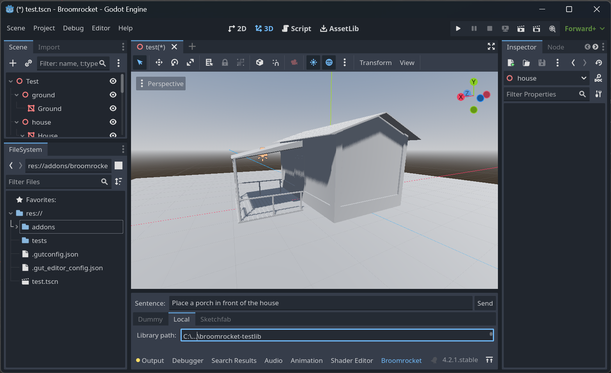

# Broomrocket for Godot: Open Source Text to 3D Scene

This experimental Godot add-on provides the ability to specify prompts in human language and place meshes in Godot from an asset library accordingly. It requires a running [Broomrocket server](https://github.com/SomethingPinkGmbH/broomrocket-server).

For example:

> Place a house. Place a table behind the house. Place a vase on the table behind the house.

The add-on supports dummy objects or a local asset library as mesh providers. It can be extended to add more providers.

## Installation

Check out this repository with submodules and open it in Godot. Start the Broomrocket server on the same machine.

## License

The code of this repository is licensed under the [MIT license](LICENSE).

## Contact

Please check [something.pink](https://something.pink/contact/) for detailed contact information.